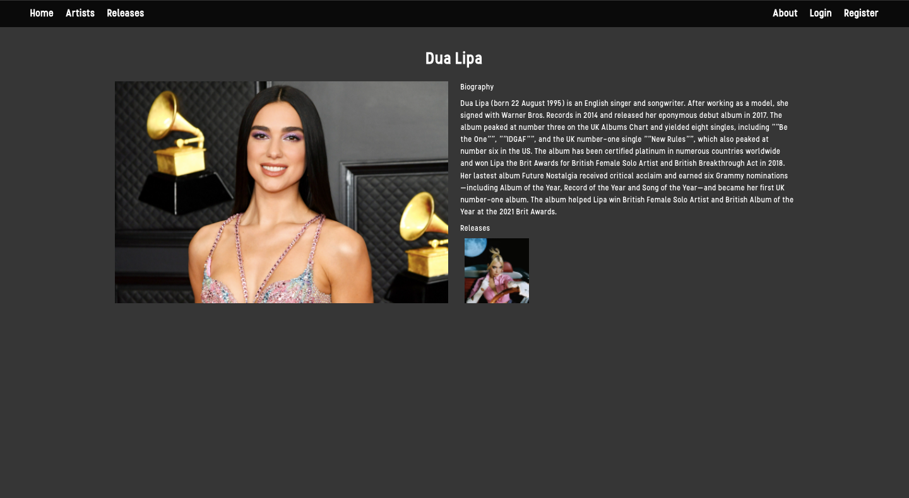

# Rateify

## Project Overview
   _Rateify_ is a full stack MERN application (MongoDB, Express, React and Node). The site allows users to discover and rate music, post their own reviews about a release, and upload a release for others to comment on. The app also allows users to listen to samples of the posted music by listening to the release's associated Spotify playlist.  _Rateify_ was a week-long group project in which I worked with [Calum MacEachen](https://github.com/calum-m708) and [Omar Al-Sanea](https://github.com/omaralsanea) to create our finished site.

## The Brief
- Build a full-stack application by making a back-end and a front-end.
- Use an Express API to serve your data from a Mongo database.
- Consume your API with a separate front-end built with React. 
- Be a complete product with multiple relationships and CRUD functionality.
- Implement wireframes that show the user journey and functionality of the application.
- Be deployed online so it’s publicly accessible.

## Concept
   Our first discussions centred around the fact that we wanted to build something that would be useful to people and that was different to other applications that we had built before. We focused on music as it was an area that we were all interested in and decided to create a site that blended musical content with user interaction for music fans looking to share their favourite releases and opinions about the music and artists who created it.

## Application Walkthrough
### Home  Page
<p align="center">
  
</p>

### Artist Index
<p align="center">
	
</p>

### Release Index
<p align="center">
	
</p>

### Artist Page
<p align="center">
	
</p>

### Release Page
<p align="center">
	
</p>

### Register
<p align="center">
	
</p>

### Login
<p align="center">
	
</p>

### About
<p align="center">
	
</p>


## Tech Stack
### Front End
- React Framework (Single Page Application)
- API Handling: Axios
- Pure CSS with Sass
- React-Router-Dom

### Back End
- Server: Node.js & Express
- Database: MongoDB & Mongoose
- Safeguarding from injection attacks: Express Mongo Sanitize
- Password Encryption: Bcrypt
- Authentication: JSON Web Token (JWT)

### Development
- Npm
- Git, GitHub
- Postman for API testing
- Excalidraw for wireframing
- Trello for setting tasks and tracking
- Zoom and VS Code Live Share for coding collaboration
- Deployment:
  - Front End: Netlify
  - Back End: Heroku & Mongo Atlas

We started by breaking the tasks down and putting them on a Trello board. While building, we spent most of the daytime lab hours taking turns 'driving' on VS Code with live share and mob-coding while on Zoom. In the evenings we tackled small tasks like collating links for pre-seeding our database, and styling components.

## Architecture:
### Front End: 
  - React Components using Hooks for state management and handling side effects
  - Bulma CSS framework for styling
  - Single Page Application (`react-router-dom`) using `Link`, `useNavigate`, `useLocation` and `useParams`
### Back End:
  - All security checks done in the back end:
    - Email validation
    - Password validation
  - Secure routing middleware
  - Error handling middleware
  - Interlinked schema models in MongoDB

## Featured Code Snippets
### Front End
The home page with carousels:
```
const Home = () => {
  const [releases, setReleases] = React.useState(null);

  React.useEffect(() => {
    const getData = async () => {
      try {
        const data = await getAllReleases();
        setReleases(data);
      } catch (err) {
        console.error(err);
      }
    };
    getData();
  }, []);

  return (
    <>
      <section className="hero is-fullheight-with-navbar has-background-dark">
        <h1 className="rateify title has-text-centered has-text-white mt-6">
          Rateify
        </h1>

        <div className="container">
          <h2 className="has-text-centered has-text-white mt-4 mb-5 is-size-4">
            {' '}
            Recently Added Releases{' '}
          </h2>
          {releases && <CarouselLatest releases={releases} />}
        </div>

        <div className="container">
          <h2 className="has-text-centered has-text-white mt-4 mb-5 is-size-4">
            {' '}
            Highest Rated Releases{' '}
          </h2>
          {releases && <CarouselGreatest releases={releases} />}
        </div>
      </section>
    </>
  );
};
```
### Back End
The JWT authentification for logged in user:
```
async function loginUser(req, res, next) {
  try {
    // ! Get the user from the database, and grab its hash.
    const user = await User.findOne({ email: req.body.email });
    // ! If there's no user
    if (!user) {
      return res.status(404).json({ message: 'Unauthorized, user not found' });
    }
    // ! Checks against the hashed pw in db, that its correct
    const isValidPw = user.validatePassword(req.body.password);

    if (!isValidPw) {
      return res
        .status(404)
        .json({ message: 'Unauthorized, passwords do not match' });
    }

    const token = jwt.sign(
      { userId: user._id, isAdmin: user.isAdmin }, // payload on our token
      secret, // the secret that only the developer knows
      { expiresIn: '240h' } // token expires in 240 hours
    );

    return res.status(202).send({ token, message: 'Login successful!' });
  } catch (e) {
    next(e);
  }
}
```

## Challenges and Wins
Adding releases currently requires using a spotify link. An unsolved issue we had was a better way to add releases that would validate in the back end, unfortunately, we ran out of time. We wanted to add an average star rating and reviews section as well, however the time constraint limited what we were able to add with our deadline. We were able to add carousels on the homepage for a win.

## Bugs
There is a bug that popped up after deployment. Registration stopped working. We hopefully will get it fixed.


